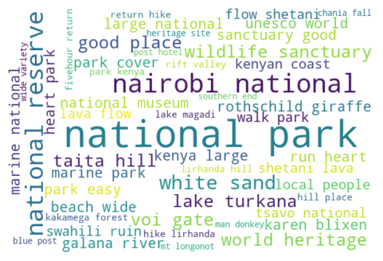

 # **Safari Travel Advisor**

 
 Web App- [Safari Travel Advisor](https://safari-travel-advisor.streamlit.app/)

 [Slideshow Presentation](https://www.canva.com/design/DAGW3KYcMBw/y9W7zhPEvOwhzUEG1OOuYQ/edit)

 [Jupyter Notebook with Cleaning and Questions](https://github.com/KImondorose/Travel-WordFinder/blob/main/main_notebook.ipynb)

 [Notebook PDF](https://github.com/KImondorose/Travel-WordFinder/blob/main/main_notebook.pdf)

 [Data Sources](https://github.com/KImondorose/Travel-WordFinder/tree/main/Data)

 [Individual Group Member Contributions](https://github.com/KImondorose/Travel-WordFinder/tree/main/work_in_progress)

 # Introduction, Business Statement, and Business Understanding

 ## Introduction and Problem Statement

 Traveling is one of the most cherished experiences globally, but finding the perfect destination that aligns with individual preferences, interests, or vacation goals remains a significant challenge for many. Travelers often spend hours researching potential destinations, sifting through reviews, or consulting friends and family to decide where to go. However, this process can be overwhelming due to the abundance of information available online, coupled with the difficulty of aligning their unique interests with the offerings of different destinations.

This project aims to solve this problem by leveraging machine learning to suggest and predict personalized travel destinations based on users' interests or the activities they wish to engage in during their vacations. By analyzing destination characteristics, the model can provide tailored suggestions, saving users time and effort while increasing their satisfaction with travel planning.

### Stakeholders:

- Travel Enthusiasts: Individuals seeking new destinations that align with their personal interests (e.g., art lovers wanting to visit galleries, nature enthusiasts looking for scenic hikes).
- Travel Agencies and Platforms: Businesses like Expedia, Booking.com, or TripAdvisor, which can integrate this  system to enhance their customer experience and increase user engagement.
- Destination Marketers: Local tourism boards or global travel organizations that can use the model to promote destinations based on specific target audience preferences.

These stakeholders would use the model to simplify decision-making, enhance customer experiences, and drive engagement or revenue growth by promoting destinations aligned with user interests.

## Business Understanding

Travel planning involves a complex interplay of preferences, budgets, and activities, often leaving individuals overwhelmed by choices or dissatisfied with their final decisions. For example, someone interested in art galleries might unknowingly miss an underrated artistic hub. Similarly, adventure seekers might struggle to identify destinations with off-the-beaten-path hiking opportunities due to limited information.

**Real-World Problem**: The real-world problem is the gap between the vast number of global travel destinations and the ability of travelers to identify those that best align with their personal interests and activities. This misalignment leads to dissatisfaction, wasted time, and potentially missed opportunities for both travelers and businesses.

**Value Proposition**: This project addresses these challenges by providing a system that:

- For Travelers: Reduces decision fatigue by offering personalized suggestions tailored to their unique interests.
- For Travel Businesses: Increases user engagement, loyalty, and potential upselling opportunities by curating destinations that resonate with users.
- For Destination Marketers: Enables targeted marketing campaigns, focusing on promoting destinations to the most relevant audiences.

By solving this problem, the project creates a win-win scenario for travelers seeking memorable experiences and businesses aiming to enhance their service offerings and revenue streams.

# Objectives

The primary objective of this project is:

- To create a machine learning model that can interpret user preferences and predict suitable country destinations using text classification techniques.

The secondary objectives are:
- To analyze the common descriptors used for top destinations on travel websites, using Lonely Planet's sample data as a benchmark.
- To compare attraction distribution across countries to identify imbalances, using Lonely Planet's sample data as a benchmark.
- To determine which countries are overrepresented on travel websites.
- To analyze international travel websites' marketing of Kenyan destinations and identify popular attractions and descriptive language used.

# Data Understanding

The success of this machine learning model hinges on the quality and relevance of the dataset, as it directly impacts the ability to provide accurate and meaningful suggestions. For this project, data was scraped from Lonely Planet's website, focusing on their curated list of must-see attractions across 25 countries. For example, [U.S. top attractions](https://www.lonelyplanet.com/usa/attractions). The dataset is well-suited to addressing the business problem because it encapsulates rich descriptive information about attractions, which is directly aligned with the model's goal of predicting the most relevant destination based on user interests.
Here is the [Python File](https://github.com/KImondorose/Travel-WordFinder/blob/main/Scraping_Python_File/lonely_planet_scraper.py) showing the scraping process.

## 1. Dataset Size
The scraped dataset contains:

18,040 rows, representing 18,040 unique text descriptions of must-see attractions across 25 countries.
This dataset size is sufficient for training a machine learning model to generalize well while covering a diverse range of attractions.
Each row corresponds to a single attraction, and the dataset offers both breadth and depth, with numerous attractions for each country. This enables the model to learn the nuanced differences in attraction types and their associations with specific destinations.

## 2. Data Sources and Suitability
The dataset includes information about the must-see attractions in each of the 25 countries, which was scraped from a reputable travel platform, Lonely Planet. Lonely Planet is a trusted resource in the travel industry, known for its in-depth and authentic coverage of global destinations. This ensures that the dataset is both reliable and relevant for a model designed to suggest/recommend travel destinations.

**Key features of the data include:**
- Description (Feature): The primary input for the model, offering detailed linguistic cues about each attraction.
- Country (Target): The output of the model, representing the predicted destination for a user’s input.
- Attraction Name: Contextual information included but not used directly in the model.
The description feature allows the model to capture user preferences and connect them to relevant destinations, while the country serves as the interpretable classification target.
The attraction descriptions serve as the core feature for the model, as they encapsulate the essence of what travelers may be seeking (e.g., cultural landmarks, artistic experiences, natural beauty). This aligns with the business problem of connecting user inputs (e.g., "art galleries" or "hiking trails") to potential destinations.

## 3. Utility for the Real-World Problem
The dataset is diverse and granular, with 18,040 unique attraction descriptions across 25 countries. Its richness and alignment with user interests make it suitable for creating a system that predicts destinations based on minimal user input. The data enables the model to generalize across a wide range of preferences, effectively addressing the challenge of personalized travel suggestions/recommendations.

## Data Limitations
While the dataset provides a solid foundation for a destination prediction system, several limitations could impact the model's performance and generalizability:

- Imbalanced Dataset: Some countries have significantly more attractions than others, potentially biasing the model toward over-represented countries. To address this, techniques like oversampling (e.g., SMOTE) or undersampling will be applied, and evaluation metrics like F1-score will ensure fair assessment across classes.

- Non-English Text: Some descriptions contain non-English words, which may introduce noise as the primary target language is English. This will be handled by translating non-English text where feasible or filtering it out during preprocessing.

- Text Cleaning: Raw text often includes irrelevant characters, stopwords, or inconsistencies. Cleaning will involve removing punctuation, stopwords, and applying lemmatization to standardize and refine the input data.

- Limited Geographic Scope: The dataset covers only 25 countries, limiting global applicability. Future iterations can incorporate additional data from other platforms or regions to expand coverage, with potential use of transfer learning to adapt the model to new data.

- By addressing these challenges through targeted preprocessing and robust modeling strategies, the project aims to ensure accurate and scalable predictions while laying the groundwork for future enhancements.

## Data Cleaning
We handled duplicate values by dropping the columns since the records were repetitive

## Exploratory Data Analysis

Class imbalance was noted particularly between the Asia/Europe/North America group (which has much more data) and the Africa/Oceania/South America/Middle East group (which has fewer data points). we need to address the imbalance

# Text Cleaning, Preprocessing , And Further Exploration
- Removing punctuation and numbers
- Lowercasing everything
- Removing stopwords
- Creating a document term matrix grouped by Country
  - Count Vectorization
  - TF-IDF Vectorization
  - Bi-grams
- Creating a document term matrix grouped by Continent
  - Count Vectorization
  - TF-IDF Vectorization
  - Bi-grams
- Visualize most frequent words
  - Word clouds
  - Bar plot or histogram

Word clouds illustrating  description of top  attractions in the dataset

  

Sample  word clouds for various countries such as Kenya

# EDA Conclusions and Recommendations
- Countries like Canada, India, Australia, United States, Italy, and France have the highest number of attractions, each showing around 1,000+ attractions in the dataset. These high counts likely indicate these countries have diverse or popular tourist destinations, making them significant for the tourism industry.
- Asia leads in the number of attractions, followed by Europe and North America. This could imply that Asia has a vast diversity of attractions or that it has been highly represented in this dataset.
- The higher number of attractions in continents like Asia and Europe could reflect established tourism infrastructure and popular cultural or historical sites.
- The presence of multiple attractions in diverse countries highlights a broad global interest in travel, with each continent offering unique experiences.
- Regions with fewer attractions listed, such as Africa and the Middle East, could represent untapped tourism potential. They may benefit from increased marketing efforts or infrastructure development to attract more tourists.
- Kenya is not well represented, with Nairobi National Park standing out as a phrase

# Modeling

## Baseline Model-Multinomial Naive Bayes(MNB)

## MNB Iteration One
A logistic regression model was built using a pipeline with a CountVectorizer. The model achieved an accuracy score of 52% on the test set and an F1 score of 48%.

## Modeling Iterations
Multiple iterations were conducted with various models, including Multinomial Naive Bayes (MNB), Random Forest, Gradient Boosting, Decision Trees, Logistic Regression, Support Vector Classifier (SVC), and K-Nearest Neighbors (KNN). Key efforts included:

- Addressing class imbalance using oversampling techniques (Random Oversampling, SMOTE) and class weights.
- Exploring TF-IDF vectorization versus CountVectorization.
- Including bi-grams for feature engineering.
- Adding country names to the stop word list.
- Hyperparameter tuning to optimize model performance.

# Model Tuning

We fine-tuned several models (Logistic Regression, Naive Bayes, GradientBoost, Random Forest, KNN, and Decision Tree) using grid search. The best-performing model was a Gradient Boosting model.

# Final Model and Its Selection
The final model is the GradientBoost Classifier, which can predict a destination with 54% accuracy and a 57% F1 score (Iteration two of the GB Classifier in this notebook with Count Vectorization). The higher the F1 score, the better is the performance of our model, and this model has the best F1 score, and the least variation between the test and train accuracies, making it the least overfit. It will generalize best to unseen data.

Accuracy and F1 score were used to evaluate model performance. With 25 target classes, accuracy is critical to gauge overall correctness. However, due to class imbalance, the weighted F1 score was prioritized to account for false positives and false negatives, offering a balanced perspective between precision and recall.

The selected model demonstrated one of the highest accuracies while avoiding overfitting, making it a strong candidate compared to other models. Although it performs well in predicting across 25 classes, further improvement is needed through additional data and fine-tuning.

Final Model Performance:

- Training Accuracy: 0.76, F1 Score: 0.78
- Testing Accuracy: 0.54, F1 Score: 0.57

# Conclusions 

The final model is the GradientBoost Classifier, which can predict a destination with 54% accuracy and a 57% F1 score (Iteration two of the GB Classifier in this notebook with Count Vectorization). The higher the F1 score, the better is the performance of our model, and this model has the best F1 score, and the least variation between the test and train accuracies, making it the least overfit. It will generalize best to unseen data.

The data put into this model is lowercased, punctuations removed, lemmatized, and with stop words removed.

# Recommendations
- **Travel Enthusiasts/Travelers**: The interactive dashboard created offers an opportunity for travel enthusiasts to shorten the time involved in decision making based on their likes and interests. Through this, they could get an opportunity to explore their best interests despite having limited time. The product simplifies their search for an appropriate travel destination.

- **Travel platforms and websites**: :Travel platforms should broaden their content to include a wider range of countries, particularly those currently underrepresented. This approach would offer more balanced visibility to diverse regions with unique attractions.
- **Destination Marketers:** 
  - The project highlights the limitations in vocabulary used to descibe top attractions in countries such as museum, art gallery, unesco world heritage, which could point to a bias in the marketing of top attractions, focusing on specific types of attractions only. Destination marketers can apply this knowledge and integrate a broader marketing approach that could highlight the rare but unique destinations to present a more balanced image.

  - Enhance Kenyan Destination Marketing:Promote Kenya's coastal beaches, urban culture, and adventure sports alongside its wildlife offerings. Use comprehensive language in promotional materials to portray Kenya as a multi-faceted destination, attracting a broader range of tourists.

# Future Work
# Future Implementation
1. Refine Machine Learning Model:Improve the text classification model's accuracy, especially for underrepresented countries.

2. Integrate with Travel Platforms:Implement the machine learning model as a personalized recommendation tool on travel websites and apps. This AI-driven feature could help users discover new destinations based on their preferences.

3. Data Expansion and Enrichment:
    - *Incorporate Additional Data*: Include diverse travel websites, lesser-known attractions, and user-generated content.
    - *Geospatial Data*: Integrate location data to enhance recommendation accuracy based on destination types.
4. Advanced NLP Techniques:
    - *Deep Learning Models*: Utilize transformers (e.g., BERT, GPT) for improved text classification accuracy.
    - *Topic Modeling*: Apply techniques like Latent Dirichlet Allocation to uncover hidden topics in travel descriptions.
5. User Profiling and Personalization: 
    - *User Profiles*: Create profiles based on travel history and preferences for personalized recommendations.
    - *Adaptive Recommendations*: Refine suggestions based on user interactions and feedback.
6. Mobile App Development:
    - Create an app offering real-time recommendations based on user preferences, travel deals, and seasonal factors.
    - Incorporate user feedback for continuous model improvement.

# Deployment

- We used Streamlit to deploy our final product as a web app where users can search for their predicted destinations based on their interests or preferences. 

- The web app is deployed and hosted [here](https://safari-travel-advisor.streamlit.app/).

